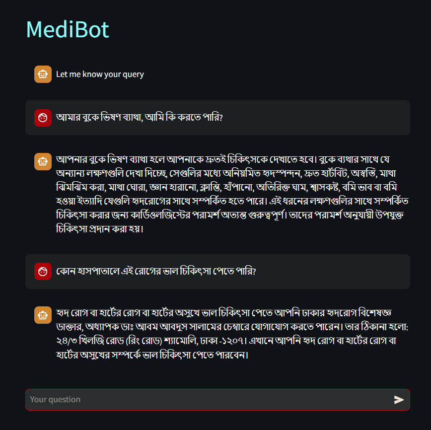

# MediBot: Medical Information Extraction Chatbot

## Description

MediBot is an advanced intelligent chatbot designed to extract and provide medical-related information. Leveraging state-of-the-art natural language processing techniques, MediBot employs Retrieval Augmented Generation (RAG) to deliver accurate and context-aware responses to medical queries.

RAG combines the power of large language models with a custom knowledge base, allowing MediBot to access and utilize specific medical information stored in its database. This approach enables the chatbot to provide more accurate, up-to-date, and relevant responses compared to traditional chatbots.

Key aspects of MediBot include:

- Utilization of RAG for enhanced accuracy and relevance in responses
- Integration with a custom medical document database for specialized knowledge
- Advanced natural language understanding to interpret complex medical queries
- Context-aware responses that consider the nuances of medical terminology
- Support for both English and Bengali languages, making it accessible to a wider audience
- A user-friendly interface built with Streamlit for easy interaction

MediBot aims to bridge the gap between complex medical information and user understanding, providing a valuable tool for both healthcare professionals and patients seeking reliable medical information.



## Features

- Natural language understanding for medical queries
- Document retrieval and context-based answering using RAG
- Support for both English and Bengali languages
- Streamlit-based user interface for easy interaction

## Installation

1. Clone the repository:
   ```bash
   git clone https://github.com/your-username/medibot.git
   cd medibot
   ```

2. Install the required dependencies:
   ```bash
   pip install -r requirements.txt
   ```

3. Set up your OpenAI API key:
   - Create a `.env` file in the root directory
   - Add your OpenAI API key: `OPENAI_API_KEY=your_api_key_here`

## Usage

1. Run the Streamlit app:
   ```bash
   streamlit run chatbot.py
   ```

2. Open your web browser and navigate to the provided local URL (usually `http://localhost:8501`)

3. Start asking medical-related questions in the chat interface

## Configuration

- Adjust the `chunk_size` and `chunk_overlap` parameters in `chatbot.py` to fine-tune document splitting
- Modify the prompt templates in `chatbot.py` to customize the chatbot's behavior

## Contributing

Contributions are welcome! Please feel free to submit a Pull Request.

## License

This project is licensed under the MIT License - see the [LICENSE](LICENSE) file for details.

## Acknowledgements

- OpenAI for providing the language model
- Langchain for the document processing pipeline
- Streamlit for the user interface framework